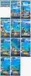

# Canonical Fishing Direction

This folder is the visual/design anchor for the current AINAN fishing game. When implementation choices conflict, prefer the rules below over older mockups.

## Mobile fishing UI blueprint

Use this screen-flow / layout blueprint as the implementation target for the fishing vertical slice:

The blueprint is intentionally stronger on **screen composition and interaction hierarchy** than on final art direction. Keep the water as the dominant playfield, keep the character secondary during active fishing, and keep all important interaction inside a single portrait phone screen.

## Core interaction

`CAST → RETRIEVE → BITE → BATTLE → CATCH → TOWN`

The main fishing game is not waiting for an automatic bite. The player casts, then gradually retrieves the lure while reading visible fish behavior and deciding when to twitch, slow-reel, or wait.

## Primary rule: the fishing playfield owns the screen

The fishing character is **not the main subject during active fishing**. The character is an animation/presentation element that supports the action.

- The majority of the phone screen belongs to **water, fish shadows, lure, line, wakes, and the fish/lure relationship**.
- Never enlarge the character at the expense of readable fishing space.
- During Retrieve, the character should be small and peripheral, and may leave the viewport during long casts.
- During Bite and Battle, the fish/lure/line relationship still has visual priority over the character.
- Character prominence is reserved for short beats: cast motion, hook reaction, catch celebration, and result payoff.
- If there is a conflict between showing the character and making the fishing interaction easier to read, **choose gameplay readability**.

## Mobile viewport contract

The product surface is always a **single portrait smartphone screen**.

- Canonical logical frame: **390 × 844**.
- The full game frame must fit inside the device visual viewport without horizontal or vertical cropping.
- iPhone safe areas / browser chrome must not hide controls or navigation.
- HUD and touch controls are screen-space UI and never move with the world camera.
- The fishing world may be larger than the phone screen, but only the world scrolls behind the fixed mobile frame.
- Do not solve long casting by making the whole game frame larger or zooming the phone UI out.
- Keep top HUD inside roughly the upper 64 px and primary fishing controls inside roughly the lower 170 px.
- The center band remains the primary water/fish/lure playfield and should occupy the clear majority of the screen.
- Result cards, tutorials, dialogs, and Town arrival presentation must all fit completely inside the portrait frame.

## Camera

- Keep the gameplay scale readable; do not zoom out just to show the full cast distance.
- The camera follows the lure only when the cast moves beyond the current viewport.
- During retrieve, frame the lure and nearby fish shadows rather than locking hard to the player.
- During Battle, frame fish + line + water first; the player is supporting context.
- Bring the camera back toward the player mainly for catch payoff.
- Camera movement changes the world composition only; fixed HUD must remain stable inside the mobile viewport.

## Composition

- The water is the playfield and must remain visually dominant.
- Player character stays at the edge/lower area when visible and must not block fish reading.
- After a long cast, the player may leave frame; that is acceptable.
- Do not use a permanent split screen or character panel during ordinary fishing.
- The diagonal line from player/rod direction to lure is a supporting visual axis, not a reason to center the character.
- Judge every composition at phone size first. Desktop width is not additional gameplay space.

## Fish readability

Fish behavior is UI. Prefer visible motion over numeric meters:

`cruise → noticed → follow → inspect → biteReady`

The player should be able to read interest from turning, pursuit, wakes, orbiting, and fleeing.

## HUD

Keep active fishing HUD minimal:

- location / essential tackle access
- cast distance / retrieve distance
- `待つ` / `ちょい巻き` / `ゆっくり巻く`
- compact battle escape + reel information

Do not reintroduce Home-like status clutter, large score/time chips, or permanently dominant panels over the water.

## Character use

- Cast: visible enough to sell the throw, but still secondary to the intended landing area.
- Retrieve: small supporting actor; water/fish/lure dominate.
- Bite: remain small so the bite itself is readable.
- Battle: slightly more visible, but fish + line + water remain primary.
- Catch: use the full success animation and final front-facing pose as the short hero payoff.

Current implementation target scale relative to the original character presentation:

- Cast: about **78%**
- Retrieve: about **34%**
- Bite/HIT: about **40%**
- Battle: about **56%**
- Catch celebration: about **96%**

These values are tuning references, not reasons to sacrifice playfield readability.

## Reward loop

The catch is not the end of the loop. The intended payoff is:

`釣れた → 町へ持ち帰る → NPC/施設/町が反応する → 次の釣りへ`

Town should visibly acknowledge the fish that was just caught before presenting growth/unlock rewards.

## Reference status

The images in this folder are design references. The interaction and layout rules in this README are authoritative when older artwork differs from the current implementation.